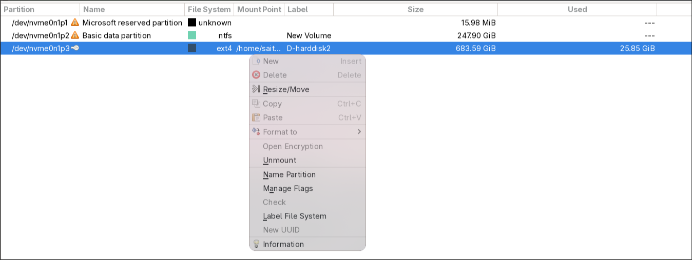

# Modify partition and disk space
```
sudo gparted
```
# Shrink hard disk and use the shrank volume for linux
## Dual boot
- Boot window then use `win + search partition`. Click on the hard drive, which I want to shrink volume then adjust the volume to shrink

- Get back to linux and use:
```
gparted
```

> Click on the `unused` and choose `new`. Choose `ext4` format then click `ok` and `apply`. You will get this result
 

```c
 @saitomu  lsblk    
NAME        MAJ:MIN RM   SIZE RO TYPE MOUNTPOINTS
nvme1n1     259:0    0 476.9G  0 disk 
├─nvme1n1p1 259:2    0   260M  0 part 
...
nvme0n1     259:1    0 931.5G  0 disk 
├─nvme0n1p1 259:8    0    16M  0 part 
├─nvme0n1p2 259:9    0 247.9G  0 part 
└─nvme0n1p3 259:10   0 683.6G  0 part 
```

### mount hard disk
Mount `nvme0n1p3` to `target path`. First, get `UUID` of the partition:
```c
 @saitomu  lsblk -f /dev/nvme0n1p3       
NAME      FSTYPE FSVER LABEL       UUID         FSAVAIL     FSUSE%  MOUNTPOINTS
nvme0n1p3 ext4   1.0   D-harddisk2 target_UID      623.6G      2% 
```
Secondly, open `/etc/fstab` and add this:
```c
// I used target path as /home/saitomu/ctf in this case
UUID=target_UID  /home/saitomu/ctf   ext4   defaults,noatime,nofail   0   2
```
Then use the command below to mount to the target path:
```c
//  -a, --all               mount all filesystems mentioned in fstab
sudo mount -a
```
>  If you want the `hard disk` to be mounted in another path, you should umount it, `umount <path>`. Otherwise, you may get duplicated mount 

Finally, give current user permission to use that hard disk memory:
```c
sudo chown -R $USER:$USER ~/workspace
```

The final result after the target path mounted:
```c
NAME      FSTYPE FSVER LABEL       UUID        FSAVAIL   FSUSE%     MOUNTPOINTS
nvme0n1p3 ext4   1.0   D-harddisk2 target_UID  623.6G     2%        /home/saitomu/ctf
```

## One boot
> No idea